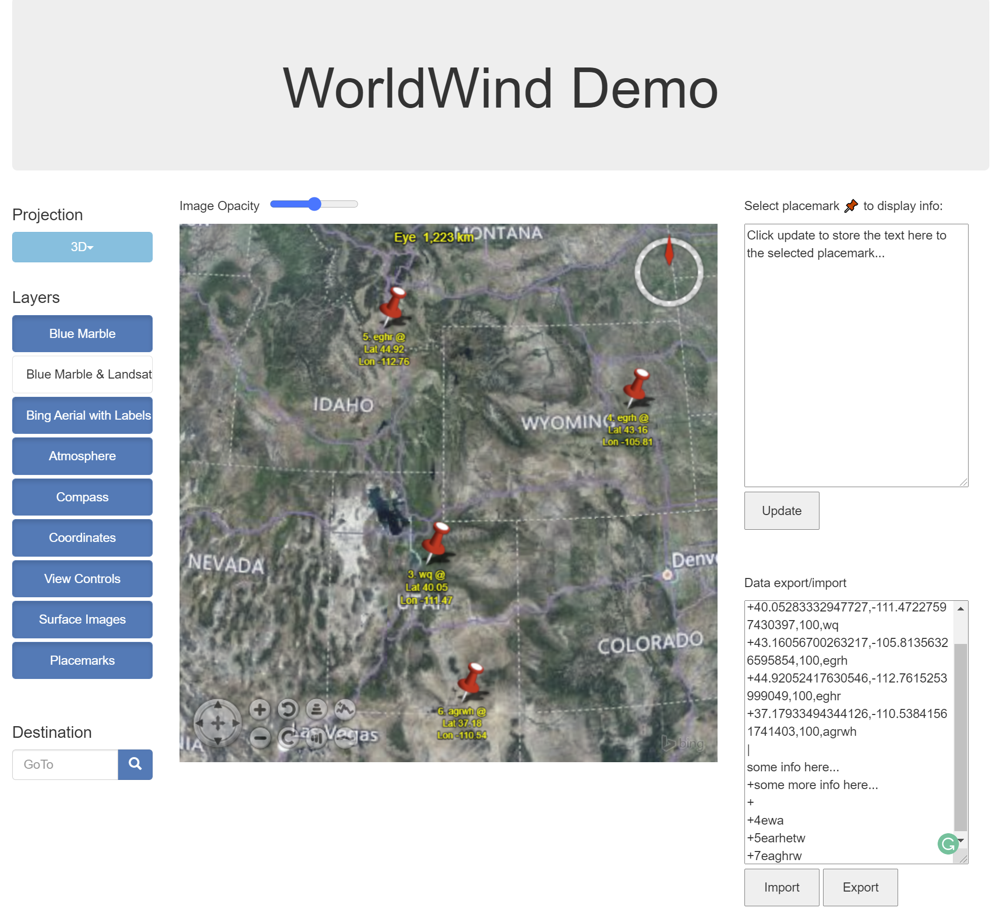
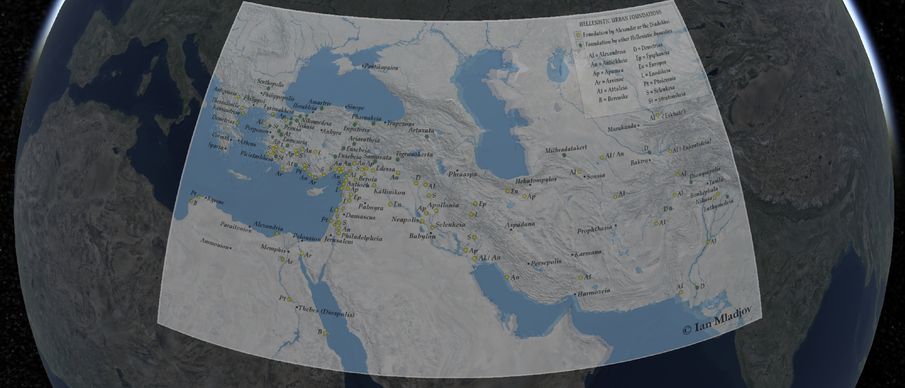

# temp_geo_infosys

This is a prototype of a web-based system for organizing information geographically and temporally for visualizing historical maps and events
 
 CesiumJS folder contains a demo for image mapping, terrain mapping, and getting coordinates on globe.

 WebWorldWind-develop folder contains a WebWorldWind based demo for the information organizing system. Placemarks can be placed on the globe and additional infomation can be added to it. And all the data can be exported or imported through a textbox.
 The time line with a sliding window for selecting data in different time period is no implemented in the demo.

Example images:

